```mermaid
flowchart TB
    subgraph current["WebSpark.Bootswatch.Demo.csproj"]
        MAIN["<b>📦&nbsp;WebSpark.Bootswatch.Demo.csproj</b><br/><small>net10.0</small>"]
        click MAIN "#websparkbootswatchdemowebsparkbootswatchdemocsproj"
    end
    subgraph downstream["Dependencies (1"]
        P1["<b>📦&nbsp;WebSpark.Bootswatch.csproj</b><br/><small>net10.0</small>"]
        click P1 "#websparkbootswatchwebsparkbootswatchcsproj"
    end
    MAIN --> P1

```

```mermaid
flowchart TB
    subgraph upstream["Dependants (1)"]
        P2["<b>📦&nbsp;WebSpark.Bootswatch.Demo.csproj</b><br/><small>net10.0</small>"]
        click P2 "#websparkbootswatchdemowebsparkbootswatchdemocsproj"
    end
    subgraph current["WebSpark.Bootswatch.csproj"]
        MAIN["<b>📦&nbsp;WebSpark.Bootswatch.csproj</b><br/><small>net10.0</small>"]
        click MAIN "#websparkbootswatchwebsparkbootswatchcsproj"
    end
    P2 --> MAIN

```

# Projects and dependencies analysis

This document provides a comprehensive overview of the projects and their dependencies after upgrading to .NET 10.0.

> **Note**: This document reflects the .NET 10 upgrade completed in version 2.0.0.

## Table of Contents

- [Projects Relationship Graph](#projects-relationship-graph)
- [Project Details](#project-details)

  - [WebSpark.Bootswatch.Demo\WebSpark.Bootswatch.Demo.csproj](#websparkbootswatchdemowebsparkbootswatchdemocsproj)
  - [WebSpark.Bootswatch\WebSpark.Bootswatch.csproj](#websparkbootswatchwebsparkbootswatchcsproj)
- [Aggregate NuGet packages details](#aggregate-nuget-packages-details)

## Projects Relationship Graph

Legend:
📦 SDK-style project
⚙️ Classic project

## Project Details

### WebSpark.Bootswatch.Demo\WebSpark.Bootswatch.Demo.csproj

#### Project Info

- **Current Target Framework:** net10.0
- **SDK-style**: True
- **Project Kind:** AspNetCore
- **Dependencies**: 1
- **Dependants**: 0
- **Number of Files**: 30
- **Lines of Code**: 3759

#### Dependency Graph

Legend:
📦 SDK-style project
⚙️ Classic project

#### Project Package References

| Package | Type | Current Version | Suggested Version | Description |
| :--- | :---: | :---: | :---: | :--- |
| System.Text.RegularExpressions | Explicit | 4.3.1 |  | NuGet package functionality is included with framework reference |
| WebSpark.HttpClientUtility | Explicit | 1.2.0 |  | ✅Compatible |

### WebSpark.Bootswatch\WebSpark.Bootswatch.csproj

#### Project Info

- **Current Target Framework:** net10.0
- **SDK-style**: True
- **Project Kind:** ClassLibrary
- **Dependencies**: 0
- **Dependants**: 1
- **Number of Files**: 33
- **Lines of Code**: 1151

#### Dependency Graph

Legend:
📦 SDK-style project
⚙️ Classic project

#### Project Package References

| Package | Type | Current Version | Suggested Version | Description |
| :--- | :---: | :---: | :---: | :--- |
| Microsoft.AspNetCore.Mvc.Razor | Explicit | 2.3.0 |  | ✅Compatible |
| Microsoft.AspNetCore.Mvc.ViewFeatures | Explicit | 2.3.0 |  | ✅Compatible |
| Microsoft.AspNetCore.StaticFiles | Explicit | 2.3.0 |  | ✅Compatible |
| Microsoft.Extensions.FileProviders.Embedded | Explicit | 9.0.9 | 10.0.0 | NuGet package upgrade is recommended |
| Microsoft.SourceLink.GitHub | Explicit | 8.0.0 |  | ✅Compatible |
| System.Text.RegularExpressions | Explicit | 4.3.1 |  | NuGet package functionality is included with framework reference |
| WebSpark.HttpClientUtility | Explicit | 1.2.0 |  | ✅Compatible |

## Aggregate NuGet packages details

| Package | Current Version | Suggested Version | Projects | Description |
| :--- | :---: | :---: | :--- | :--- |
| Microsoft.AspNetCore.Mvc.Razor | 2.3.0 |  | [WebSpark.Bootswatch.csproj](#websparkbootswatchcsproj) | ✅Compatible |
| Microsoft.AspNetCore.Mvc.ViewFeatures | 2.3.0 |  | [WebSpark.Bootswatch.csproj](#websparkbootswatchcsproj) | ✅Compatible |
| Microsoft.AspNetCore.StaticFiles | 2.3.0 |  | [WebSpark.Bootswatch.csproj](#websparkbootswatchcsproj) | ✅Compatible |
| Microsoft.Extensions.FileProviders.Embedded | 9.0.9 | 10.0.0 | [WebSpark.Bootswatch.csproj](#websparkbootswatchcsproj) | NuGet package upgrade is recommended |
| Microsoft.SourceLink.GitHub | 8.0.0 |  | [WebSpark.Bootswatch.csproj](#websparkbootswatchcsproj) | ✅Compatible |
| System.Text.RegularExpressions | 4.3.1 |  | [WebSpark.Bootswatch.Demo.csproj](#websparkbootswatchdemocsproj) [WebSpark.Bootswatch.csproj](#websparkbootswatchcsproj) | NuGet package functionality is included with framework reference |
| WebSpark.HttpClientUtility | 1.2.0 |  | [WebSpark.Bootswatch.Demo.csproj](#websparkbootswatchdemocsproj) [WebSpark.Bootswatch.csproj](#websparkbootswatchcsproj) | ✅Compatible |

